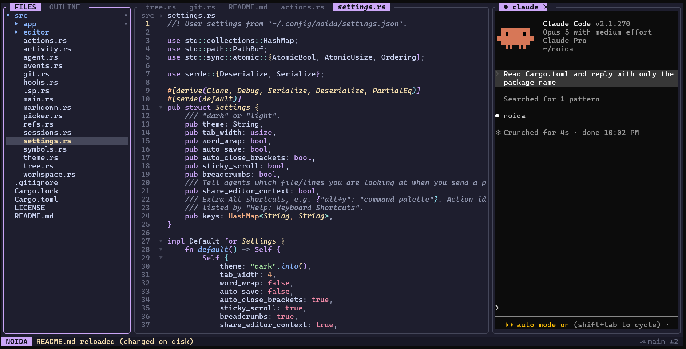
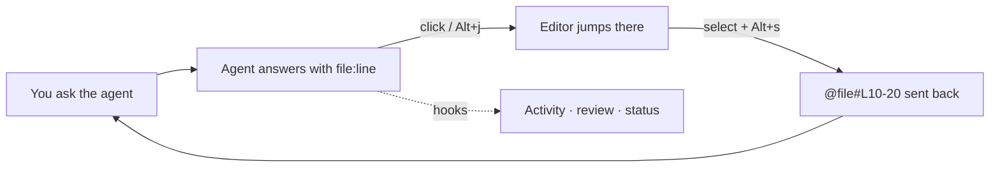

<div align="center">

# ⌘ NOIDA

### Navigation-Oriented IDE for Developer Agents

**A lightweight terminal IDE for code your agent writes.** Your real Claude Code or Codex on the right, a proper editor on the left, and every file the agent mentions one click away. ~20 MB of RAM, no Electron.

[](https://github.com/its-banana-coder/noida/actions/workflows/ci.yml)
[](#-project-status)
[](https://crates.io/crates/noida)
[](https://www.rust-lang.org)
[](LICENSE)
[](#-project-status)
[](https://docs.claude.com/en/docs/claude-code)
[](https://github.com/openai/codex)

[Website](https://its-banana-coder.github.io/noida/) · [Install](#-install) · [Features](#-features) · [Keys](#%EF%B8%8F-keybindings) · [Roadmap](#%EF%B8%8F-roadmap) · [Status](#-project-status) · [Feedback](#-feedback)

</div>

<p align="center">
  
  <br>
  <sub>Ask Claude where something lives · <kbd>Alt+j</kbd> labels the answer's file references · the editor opens it at that line.<br>An unedited recording of a real session, made by <a href="scripts/record-demo.py">scripts/record-demo.py</a>.</sub>
</p>

<p align="center">
  
  <br>
  <sub>File tree · editor · Claude Code in its real terminal, all in one terminal window</sub>
</p>

> [!WARNING]
> **Early preview (alpha).** NOIDA is used daily on Linux and WSL2. CI builds and tests every commit on Linux and macOS, but hands-on Mac use is still limited. Expect rough edges and please [tell us what breaks](#-feedback).

---

## 💡 Why NOIDA

Coding agents live in the terminal, but you still open a heavy IDE just to read the code they talk about. NOIDA replaces that IDE for agent-driven work, and is the cockpit between you and your agents:

- **It runs the real CLIs.** `claude` and `codex` run unmodified in real terminals, so your login, `CLAUDE.md`, MCP servers and slash commands all just work.
- **It closes the loop.** Ask → see `file:line` → click → read the code → select → send it back. The whole loop takes seconds.
- **It knows what agents did.** Hooks report every read, edit, command and permission prompt, so you can review changes hunk by hunk.



---

## 🚀 Install

**macOS (Homebrew)**

```bash
brew tap its-banana-coder/noida
brew install noida
```

**Debian / Ubuntu / WSL (apt repository, with upgrades)** — add it once:

```bash
sudo install -d /etc/apt/keyrings
curl -fsSL https://its-banana-coder.github.io/noida/apt/key.gpg | sudo tee /etc/apt/keyrings/noida.gpg >/dev/null
echo "deb [arch=amd64,arm64 signed-by=/etc/apt/keyrings/noida.gpg] https://its-banana-coder.github.io/noida/apt stable main" | sudo tee /etc/apt/sources.list.d/noida.list >/dev/null
sudo apt update && sudo apt install noida
```

After that, `sudo apt upgrade` keeps NOIDA current. If you also ran `cargo install noida`, remove it (`cargo uninstall noida`) so `~/.cargo/bin` doesn't shadow the packaged binary. To install a single `.deb` instead: `curl -LO https://github.com/its-banana-coder/noida/releases/download/v0.1.4-alpha/noida_amd64.deb && sudo apt install ./noida_amd64.deb`

**Fedora / RHEL / openSUSE (dnf repository, with upgrades)** — add it once:

```bash
sudo dnf config-manager --add-repo https://its-banana-coder.github.io/noida/rpm/noida.repo
sudo dnf install noida
```

On older releases use `sudo dnf config-manager --add-repo=...`, and on openSUSE `sudo zypper ar https://its-banana-coder.github.io/noida/rpm/noida.repo && sudo zypper in noida`. The repository metadata is GPG-signed with the same key as the apt repository, and `dnf upgrade` keeps NOIDA current. To install a single `.rpm` instead:

```bash
curl -LO https://github.com/its-banana-coder/noida/releases/download/v0.1.4-alpha/noida.x86_64.rpm
sudo dnf install ./noida.x86_64.rpm      # or: sudo rpm -i noida.x86_64.rpm
```

**Any Linux, or macOS without Homebrew** — download a binary from the [latest release](https://github.com/its-banana-coder/noida/releases):

```bash
tar xzf noida-*.tar.gz && sudo mv noida /usr/local/bin/    # or any directory on your PATH
xattr -d com.apple.quarantine /usr/local/bin/noida         # macOS only, if Gatekeeper blocks it
```

**With Rust** (1.88+ and a C linker: `build-essential` on Debian/Ubuntu, `xcode-select --install` on macOS):

```bash
cargo install noida                                        # from crates.io
cargo install --git https://github.com/its-banana-coder/noida   # or the latest commit
```

**Windows (PowerShell)** — a native `noida.exe`, no WSL:

```powershell
irm https://its-banana-coder.github.io/noida/install.ps1 | iex
```

That downloads the latest release, installs it under `%LOCALAPPDATA%\Programs\noida`, puts it on your PATH for this session and the next, and tells you if `git` or an agent CLI is missing. No administrator rights needed, and running it again upgrades in place. ([Read it first](docs/install.ps1) if you'd rather not pipe a script into your shell — it is about 80 lines.)

Then open a fresh [Windows Terminal](https://aka.ms/terminal) and run `noida .`. The agent hooks use a loopback socket instead of a Unix socket, and `claude`/`codex` start through their npm `.cmd` shims. The installer and the binary have been run on Windows 11, and CI runs the full test suite on every push, but nobody has driven the TUI through a full session there yet — so if something looks wrong, [please open an issue](https://github.com/its-banana-coder/noida/issues). [WSL](https://learn.microsoft.com/windows/wsl/install) with the `.deb` above is the fallback.

| Download | For | Checked |
|---|---|---|
| `brew install …` / `noida-aarch64-apple-darwin.tar.gz` | macOS on Apple Silicon | ✅ installed and run on a macOS runner every week |
| `noida-x86_64-apple-darwin.tar.gz` | macOS on Intel | ⚠️ builds, but nobody has run it yet |
| apt repository / `noida_amd64.deb` | Debian, Ubuntu, WSL (x86_64) | ✅ installed from the repo on Ubuntu 22.04 (WSL) and in CI |
| dnf repository / `noida.x86_64.rpm` | Fedora, RHEL, openSUSE (x86_64) | ⚠️ built and signed in CI; not yet installed on a real Fedora machine |
| `noida-x86_64-unknown-linux-musl.tar.gz` | Any Linux x86_64 (static) | ✅ runs on Ubuntu 22.04 |
| `noida-x86_64-unknown-linux-gnu.tar.gz` | Linux x86_64, glibc 2.35+ | ✅ runs on Ubuntu 22.04 |
| `noida-aarch64-unknown-linux-gnu.tar.gz` / `noida_arm64.deb` / `noida.aarch64.rpm` | Linux on ARM64: Raspberry Pi, Ampere, Graviton | ⚠️ built on an arm64 runner; not yet installed on real hardware |
| `install.ps1` / `noida-x86_64-pc-windows-msvc.zip` | Windows 10/11 (x86_64) | ⚠️ installed and launched on Windows 11; TUI not yet driven through a full session |
| `cargo install noida` | Any platform with Rust | ✅ installed from crates.io |

Every download has a `.sha256` checksum beside it (`shasum -a 256 -c noida-*.sha256`).

> **About the macOS binaries.** NOIDA is a command-line program, so it ships as a `.tar.gz`, not a `.dmg` (disk images are for apps you drag into Applications). Downloaded binaries aren't signed by Apple yet, so macOS may say *"cannot be opened because the developer cannot be verified"*: the `xattr` command above clears that. **Homebrew avoids the warning**, so it's the easiest route on a Mac.

**An agent** (NOIDA adds a tab for each one on your `PATH`, plus a shell): [Claude Code](https://docs.claude.com/en/docs/claude-code) (`claude`) · [Codex CLI](https://github.com/openai/codex) (`codex`)

**Run it**

```bash
noida                       # current directory
noida ~/code/my-project     # a project
noida src/main.rs:120       # a file at a line
noida --fresh               # don't restore the last session
noida --agent aider="aider --no-git" --agent shell=bash   # custom agent tabs
```

> Use a terminal with truecolor and mouse support: iTerm2, Ghostty, WezTerm, kitty, Alacritty, Windows Terminal or GNOME Terminal. In tmux, run `set -g mouse on`.
> **On a Mac, read [macOS: Option as Alt](#-macos-option-as-alt) first.**
> For code intelligence, install a language server, e.g. `rustup component add rust-analyzer` or `npm i -g typescript-language-server typescript`.

---

## ✨ Features

<table>
<tr>
<td width="50%" valign="top">

### 🤖 Agents
- **Real CLIs in real PTYs**, in tabs or split side by side (`Alt+v`)
- **Many sessions, like VS Code**: `+` on the tab bar or `Alt+N` starts a new Claude session; tabs are named after the conversation and can be renamed; `✕` closes one
- **Sessions** (`Alt+g`): switch tabs or resume any past Claude/Codex conversation. Everything is restored on the next launch.
- **Browse history** (`Alt+H`): read past conversations as formatted transcripts, then resume one with `r`
- **Exact status via hooks**: `⠙` working · `✓` finished · `!` needs permission
- **Permission alerts** say what the agent wants to run
- **Activity timeline** (`Alt+a`) of reads, edits and commands, plus a persistent history
- **Handoff**: ask Codex to review Claude's changes, or ask one agent to fix the other's review findings
- **Changed files per agent** (`Alt+C`) with reviewed tracking; tabs show `○N` unreviewed files
- **Compare two agents** side by side, or send the same prompt to both
- **Worktree agents**: isolate an agent in its own git worktree, then apply its changes

</td>
<td width="50%" valign="top">

### 🧭 Agent ↔ code
- **Clickable references**: `app.rs:42`, `#L10-20`, `(lines 10-20)`, `around line 120`, `Read(src/app.rs)`, `a/src/app.rs`
- **Short paths** like `index.ts:146` are matched against your project, with a picker if several files match
- **Clickable symbols**: `resolveAnimatedLayout` in agent output jumps to its definition
- **Find and copy in agent output**: `Alt+?` searches the scrollback too; drag with the mouse to copy
- **Keyboard jumps**: `Alt+j` labels every reference on screen
- **Send context**: `Alt+s` selection · `Alt+S` file · `Alt+e` explain / refactor / find bugs / write tests / fix problem
- **Editor context sharing**: when you prompt Claude, it's told which file and lines you're looking at (toggle in the palette)

</td>
</tr>
<tr>
<td valign="top">

### 🌿 Git
- Branch and change count, tree markers, gutter change bars
- **Review changes** (`Alt+r`): **accept** (stage) or **reject** (revert) each hunk, whole files, or everything
- After a turn, `Alt+r` opens only the files the agent changed
- **Staged view** (`s` in review) with unstage by hunk or file
- **Commit log** and **file history** with read-only commit diffs
- Switch branch, new branch, commit

</td>
<td valign="top">

### 🧠 Code intelligence
- **Tree-sitter** outline, project symbols and structural selection for Rust, TS/TSX, JS, Python, Go and Java
- **LSP** (rust-analyzer, TypeScript 7's built-in server or typescript-language-server, Pyright/pylsp, gopls): diagnostics, hover, signature help, definition, references, **rename across files**, code actions, format, organize imports
- No language server? Definitions come from the tree-sitter index and references from project search.

</td>
</tr>
<tr>
<td valign="top">

### ✏️ Editor
- **Multi-cursor**: `Ctrl+D`, `Alt+click`, `Ctrl+Alt+↑/↓`, column selection
- **Find/replace** with case, word, regex (`$1`) and in-selection options
- **Workspace search & replace** (`Alt+/`) with a replacement preview and per-match excludes
- Auto-closing brackets and tags, comments, move/copy/delete line
- **Markdown preview**: `.md` files open rendered (headings, lists, tables, code, callouts); `Alt+m` switches to editing
- Folding, word wrap, sticky scroll, breadcrumbs
- **Split editor** (`Ctrl+\`): two editor groups side by side, restored on the next launch
- Preview and pinned tabs, reopen closed tab, recent files

</td>
<td valign="top">

### 🗂️ Workspace
- **Command palette** (`Alt+x`) and fuzzy file open (`Alt+o`)
- File tree: new, rename/move, delete, copy path, reveal in the file manager
- **Outline** panel that follows the cursor
- Files reload automatically when agents edit them
- **NOIDA Dark / Light** themes and `~/.config/noida/settings.json`
- **Custom keybindings**, plus `Ctrl+Shift` shortcuts in kitty-protocol terminals

</td>
</tr>
</table>

---

## ⌨️ Keybindings

Global shortcuts use **Alt** (**⌥ Option** on a Mac), so ordinary keys still reach your agent, and they avoid Claude Code's own Meta bindings. **`Alt+x` lists every command with its shortcut.**

> **No Alt key working?** Every `Alt+key` shortcut also works as **`Ctrl+]` then `key`**, in any terminal and on any keyboard layout. For example `Ctrl+]` `x` opens the command palette. Press `Ctrl+]` twice to send it to the agent.

### 🍎 macOS: Option as Alt

By default, Mac terminals use Option to type special characters (`⌥x` types `≈`), so NOIDA never sees the shortcut. Claude Code's own Option shortcuts need the same setting. Either use the **`Ctrl+]` leader** above, or turn on Option-as-Meta in your terminal:

| Terminal | Setting |
|---|---|
| **iTerm2** | Settings → Profiles → Keys → *Left Option key* → **Esc+** |
| **Terminal.app** | Settings → Profiles → Keyboard → **Use Option as Meta key** (Terminal.app lacks truecolor, so iTerm2, Ghostty or WezTerm look better) |
| **Ghostty** | `macos-option-as-alt = true` in the config |
| **WezTerm** | Works by default with the left Option key; for both, set `send_composed_key_when_right_alt_is_pressed = false` |
| **kitty** | `macos_option_as_alt yes` in `kitty.conf` |
| **Alacritty** | `[window] option_as_alt = "Both"` in `alacritty.toml` |
| **VS Code terminal** | `"terminal.integrated.macOptionIsMeta": true` |

Also on a Mac:
- `Ctrl` shortcuts (`Ctrl+S`, `Ctrl+F`, `Ctrl+D`…) use **Control**, not ⌘ Command. Terminals don't pass ⌘ shortcuts to apps.
- Some terminals use `⌥+click` for their own selection. If `Alt+click` doesn't add a cursor, use `Ctrl+D` or `Ctrl+Alt+↑/↓` instead.
- `F2`, `F3` and `F12` may need the **fn** key.


| Key | Action | Key | Action |
|---|---|---|---|
| `Alt+x` | Command palette | `Alt+o` / `Ctrl+P` | Open file (`name:120` jumps to a line) |
| `Alt+1/2/3` | Focus files / editor / agent | `Alt+0` | Toggle file tree |
| `Alt+j` | Jump to a reference in agent output | `Alt+g` | Sessions: switch, new, resume |
| `Alt+n` / `Alt+v` / `Alt+w` | Next agent / split / other pane | `Alt+s` / `Alt+S` | Send selection / file |
| `Alt+N`, click `+` | New Claude session | `Alt+W`, click `✕` | Close agent tab |
| `Alt+H` | Browse past conversations | `Alt+C` | Changed files per agent |
| `Alt+F` | Format document | | |
| `Alt+e` | Ask agent… | `Alt+/` | Search in workspace |
| `Alt+r` | Review changes | `Alt+a` | Agent activity |
| `Alt+l` / `Alt+k` | Symbols in file / project | `Alt+i` | Problems |
| `Alt+E` / `Alt+T` | Recent files / reopen closed | `Alt+-` | Go back |
| `Alt+z` / `Alt+<` / `Alt+>` | Zoom / resize agent pane | `Alt+q` | Quit |
| `Alt+?` (agent pane) | Find in agent output | drag (agent pane) | Select and copy output |

<details>
<summary><b>Editor keys</b></summary>

| Key | Action |
|---|---|
| `Ctrl+S` | Save |
| `Ctrl+F` / `Ctrl+H` | Find / replace (in the widget: `Alt+c` case, `Alt+w` word, `Alt+r` regex, `Alt+l` in selection, `Alt+a` replace all, `Alt+Enter` select all matches) |
| `F3` / `Shift+F3` | Next / previous match |
| `Ctrl+D` · `Alt+click` · `Ctrl+Alt+↑/↓` | Add cursor at next occurrence / at click / above or below (`Esc` returns to one) |
| `Alt+drag` | Column selection |
| `Ctrl+/` | Toggle comment |
| `Alt+↑/↓` · `Alt+Shift+↑/↓` | Move line · copy line |
| `Ctrl+K` · `Ctrl+L` | Delete line · select line |
| `F12` · `Ctrl+click` · `Shift+F12` | Go to definition · find references |
| `F2` · `Alt+h` · `Alt+.` · `Alt+F` | Rename symbol · hover · code actions · format document |
| `Alt+Shift+→ / ←` | Expand / shrink selection by syntax |
| `Alt+← / →` | Back / forward |
| `Ctrl+G` | Go to `line[:col]` |
| `Ctrl+Z` / `Ctrl+Y` | Undo / redo |
| `Ctrl+C` / `Ctrl+X` | Copy / cut to the system clipboard (the line if nothing is selected) |
| `Tab` / `Shift+Tab` | Indent / dedent |
| `Ctrl+W` · middle-click | Close tab |
| `Ctrl+PgUp` / `Ctrl+PgDn` | Previous / next tab |
| `Ctrl+\` | Split the editor into two groups (palette: *Focus Other Editor Group*, *Move Tab to Other Editor Group*, *Close Editor Group*; click a group to focus it) |

</details>

<details>
<summary><b>File tree, review and agent pane keys</b></summary>

**File tree**: `↑/↓` or `j/k` move · `Enter` open · `Space` preview · `←/→` collapse/expand · `a` new file · `A` new folder · `r`/`F2` rename · `d` delete · `y`/`Y` copy path · `o` reveal in file manager · `Tab` outline · `R` refresh

**Review changes**: `↑/↓` hunks · `Tab` next file · `a` accept hunk · `x` reject hunk · `A`/`X` whole file · `s` switch to staged changes · `u`/`U` unstage hunk/file · `Enter` open · `r` refresh · `Esc` close

**Past conversation** (`Alt+H`): `↑/↓` `PgUp/PgDn` scroll · `r` resume in a new tab · `Esc` close

**Agent pane**: every key goes to the agent · mouse wheel scrolls back · `Alt+?` finds text in the output and scrollback (`Enter`/`↓` next, `↑` previous, `Esc` close; capitals make it case-sensitive) · drag to select and copy (unless the app uses the mouse itself) · **Agent: Copy Visible Output** in `Alt+x` copies the screen · click a highlighted path or symbol to open it · click `✕` on a tab (or middle-click it) to close it

</details>

### Ctrl+Shift shortcuts

In terminals that support the [kitty keyboard protocol](https://sw.kovidgoyal.net/kitty/keyboard-protocol/) (kitty, WezTerm, Ghostty, foot, recent iTerm2), NOIDA also accepts `Ctrl+Shift+P` palette · `Ctrl+Shift+F` / `Ctrl+Shift+H` search / replace in workspace · `Ctrl+Shift+O` symbols in file · `Ctrl+Shift+K` delete line · `Ctrl+Shift+T` reopen closed tab · `Ctrl+Shift+E` file tree. Other terminals send these as plain `Ctrl+key`. Start with `--no-kitty-keys` to turn the protocol off.

### Custom keybindings

Add a `keys` map to `~/.config/noida/settings.json` (`Alt+x` → *Preferences: Open Settings*). Keys look like `alt+y`, `ctrl+alt+k`, `ctrl+shift+p`, `f5`; `alt+S` is the same as `alt+shift+s`. Map a key to `""` or `"none"` to free a built-in shortcut for your agent:

```json
{
  "keys": {
    "alt+y": "command_palette",
    "f5": "review_changes",
    "ctrl+alt+k": "new_agent_claude",
    "alt+n": "none"
  }
}
```

Run **Help: Keyboard Shortcuts** from the palette to see every action's id and current shortcut. Custom bindings work in every pane, including the agent pane, and are read at startup; invalid entries are reported in the status bar.

---

## 🗺️ Roadmap

NOIDA's goal is to be **the cockpit between developers and coding agents**: a lightweight replacement for heavy IDEs when the agent does most of the typing. The editor, tree and terminal exist to make that workflow fast.

### ✅ Shipped
- [x] **Foundation:** real agent CLIs in PTYs, sessions and resume, clickable file and symbol references, hook-based status and activity, hunk-by-hunk review, worktree agents, LSP and tree-sitter, multi-cursor editor, workspace search, command palette
- [x] **Editor completeness:** split editor, custom keybindings, kitty keyboard protocol, Markdown preview, find and copy in agent panes, git staged view, log and file history
- [x] **Deeper agent integration:** editor context sharing, changed files per agent with review tracking, compare two agents, send one prompt to two agents, implement → review → fix handoffs
- [x] **Sessions like VS Code:** new session button, conversation-named tabs, rename, browsing past conversations
- [x] **Hardening:** CI on Linux and macOS, [latest release](https://github.com/its-banana-coder/noida/releases) with prebuilt binaries, issue templates, [smoke-test checklist](TESTING.md), [website](https://its-banana-coder.github.io/noida/)
- [x] **Language servers verified:** rust-analyzer, TypeScript 7 (built-in server), Pyright
- [x] **Easy install:** [crates.io](https://crates.io/crates/noida), Homebrew tap for macOS, signed apt and dnf repositories, static Linux binary, native Windows build

### 🔨 Next
- [ ] Hands-on macOS testing (iTerm2, Ghostty, Terminal.app), including the Intel binary; help wanted, see [TESTING.md](TESTING.md)
- [ ] Signed and notarized macOS binaries
- [ ] Polish from early feedback
- [ ] Verify gopls and pylsp

### 🔭 Later
- [ ] Remote development over SSH
- [ ] Project map and dependency view for monorepos
- [ ] Parallel task board across agents
- [ ] Plugin ecosystem for commands, agents, language support, themes and workflow integrations ([roadmap](docs/plugin-ecosystem-roadmap.md))
- [ ] Optional small local model for cheap context work (summarising files, finding relevant code) to cut agent token use

### 🚫 Non-goals
Extension marketplace · built-in AI chat or model · accounts and cloud sync · browser · notebooks · debugger · Docker/package-manager UIs · hundreds of themes. NOIDA stays small on purpose; the terminal and your agent do the rest.

---

## 📊 Project status

| | |
|---|---|
| ✅ **Tested live** (Linux/WSL2, tmux and Windows Terminal, Claude Code 2.1, Codex CLI, rust-analyzer) | Reference clicking and jumps · agent tabs, split, hook status, activity, sessions/resume, new-session button, rename, history browser, workspace restore · hunk review, staged view, log and file history · worktree agents · LSP with rust-analyzer, TypeScript 7 and Pyright (diagnostics, hover, definition, references, format, code actions) · editing, multi-cursor, find widget, split editor, Markdown preview · find and copy in agent panes · custom keybindings · changed files per agent · workspace search/replace · tab and file tree actions · folding, word wrap · code actions, formatting · light theme |
| 🍎 **macOS** | Builds and all tests pass in CI on every commit; little hands-on use yet |
| 🧪 **Unit-tested, little hands-on use** | `Ctrl+Shift` shortcuts (kitty protocol) · compare agents, send prompt to two agents, fix-findings handoff · editor context sharing · sticky scroll |
| ❔ **Not tested yet** | The Windows build on a real Windows machine (it builds and passes every test in CI) · very large repos · gopls and pylsp |

**Good to know**
- 💥 Agents run inside NOIDA, so a crash stops them too. Your terminal is restored, and conversations can be resumed via **Sessions** (`Alt+g`).
- ↩️ Launching NOIDA resumes the previous Claude conversation. Use `--fresh` to start clean.
- 🗑️ Destructive actions (reject, delete, replace in workspace, remove worktree) ask for a second press, and rejected changes are gone from disk. **Commit first.**
- 🔒 NOIDA passes its hooks with `--settings` when it starts an agent. Your Claude and Codex config files are never modified.

<details>
<summary><b>How the agent integration works</b></summary>

- `claude` is started with `--settings '<hooks>'` and `--session-id <uuid>`. The hooks run `noida hook`, which forwards the event over a local Unix socket and prints nothing, so it never affects Claude's decisions or permission prompts.
- `codex` is started with `-c notify=[noida, hook-codex]` to report finished turns.
- Workspace state lives in `~/.local/share/noida/workspaces/`, agent history in `~/.local/share/noida/history/`.

</details>

<details>
<summary><b>Known limitations</b></summary>

- Most terminals can't distinguish `Shift+Enter` from `Enter`. Use the agent's own newline shortcut (in Claude Code, `\` then `Enter`).
- NOIDA's Alt shortcuts aren't passed through to the agent.
- Editor zoom and fonts are controlled by your terminal.

</details>

---

## 💬 Feedback

Bug reports make NOIDA better. [Open an issue](https://github.com/its-banana-coder/noida/issues) and include:

- 🖥️ OS and terminal (e.g. *Ubuntu on WSL2, Windows Terminal 1.21*)
- 🤖 Agent and version (`claude --version`, `codex --version`)
- 🔁 What you did, what you expected, and what happened
- 🔗 If a reference wasn't clickable, the **exact line of agent output**

---

## 🛠️ Development

```bash
cargo run -- .     # run from source
cargo test         # unit tests
```

Before a release, run the [smoke-test checklist](TESTING.md) in a real terminal.

<details>
<summary><b>How releases are built</b></summary>

- Every push runs CI on GitHub Actions: build and all tests on Ubuntu and macOS, plus a build with the minimum Rust version (1.88).
- Pushing a `v*` tag runs the [release workflow](.github/workflows/release.yml) on GitHub-hosted machines:
  - **Linux** builds on Ubuntu 22.04 (so the glibc build runs on 22.04 and newer) plus a fully static musl build, and `.deb`/`.rpm` packages (the `.deb` is installed and run in CI).
  - **Windows** builds on `windows-latest` with MSVC and ships as a `.zip`; CI runs the whole test suite there on every push.
  - **Linux on ARM64** builds natively on GitHub's `ubuntu-22.04-arm` runners, with its own `.deb` and `.rpm`; both repositories serve `amd64` and `arm64`.
  - **macOS** builds on an Apple Silicon runner. The Intel binary is cross-compiled there, because GitHub no longer offers Intel Mac runners.
  - Each binary is started with `--version` where the runner can execute it, then packaged with a checksum and attached to a GitHub Release. Tags with `-alpha` or `-beta` are marked as prereleases.
- **apt and dnf repositories:** `scripts/publish-repos.sh` rebuilds both pools and their signed metadata from every release and pushes the site plus repository to the `gh-pages` branch, which GitHub Pages serves. The signing key stays on the maintainer's machine; only the public key is published.
- **Homebrew:** `scripts/update-homebrew.sh <tag>` regenerates the formula in [its-banana-coder/homebrew-noida](https://github.com/its-banana-coder/homebrew-noida) from the release checksums; that tap installs and runs NOIDA on a macOS runner weekly.
- Nothing is built on a developer's machine, and no binary is signed yet.
- **Cost:** CI, releases and the website run on GitHub Actions, Releases and Pages, which are free for public repositories. Signing and notarizing macOS binaries would need an Apple Developer account ($99/year), which the project doesn't have yet.

</details>

<details>
<summary><b>Code layout</b></summary>

| Path | Purpose |
|---|---|
| `src/main.rs` | CLI, terminal setup, event loop, hook client entry points |
| `src/app/` | State and commands (`mod.rs`), layout (`draw.rs`), review/activity views, workspace search, find widget, tabs/tree/outline, LSP editor features |
| `src/editor/` | Multi-cursor buffer, search, folding (`mod.rs`), layout and rendering (`view.rs`), language conventions (`lang.rs`) |
| `src/agent.rs` | PTYs, vt100 emulation, key encoding, terminal query replies |
| `src/refs.rs` | File and symbol reference detection in agent output |
| `src/hooks.rs` · `src/activity.rs` · `src/sessions.rs` | Agent hooks, activity/history, past session discovery |
| `src/git.rs` | Status, diffs, hunk stage/revert, branches, worktrees |
| `src/symbols.rs` · `src/lsp.rs` | Tree-sitter symbols, LSP client |
| `src/actions.rs` · `src/picker.rs` | Command registry, fuzzy picker |
| `src/workspace.rs` · `src/settings.rs` · `src/theme.rs` · `src/events.rs` | Session restore, settings, palettes, background event bus |
| `src/tree.rs` | File tree |
| `src/markdown.rs` · `src/keys.rs` · `src/changes.rs` | Markdown preview, key specs for custom bindings, per-agent review tracking |
| `src/app/groups.rs` · `src/app/agent_views.rs` | Split editor groups, changed-files and compare views |

</details>

---

<div align="center">

**[MIT](LICENSE)** · Built for developers who pair with agents

</div>
